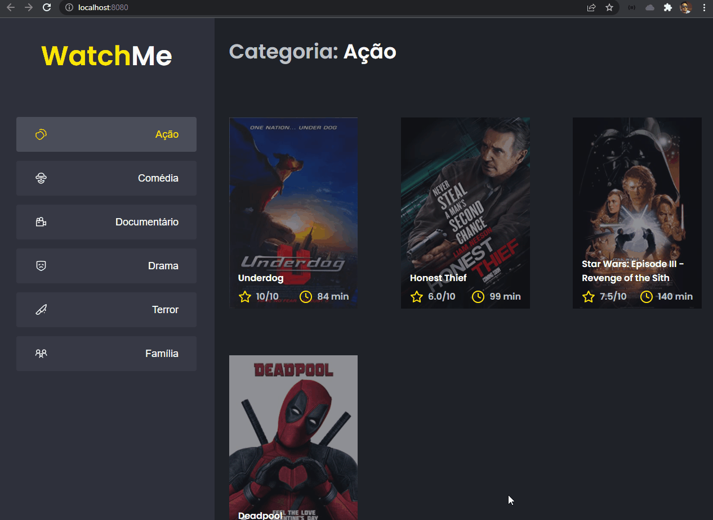

# Desafio Ignite - Rocketseat
<br>
Segundo desafio prático na trilha de React

* [Sobre](#sobre)
* [Instalação](#instalação)


## Sobre
 * Uma aplicação onde o principal objetivo é refatorar uma página para listagem de filmes de acordo com gênero.
    - A aplicação possui apenas uma funcionalidade principal que é a listagem de filmes;
    - Na sidebar é possível selecionar qual categoria de filmes deve ser listada;
    - A primeira categoria da lista (que é "Ação") já deve começar como marcada;
    - O header da aplicação possui apenas o nome da categoria selecionada que deve mudar dinamicamente.
<br>


## Instalação

#### Pré-requisitos
Antes de começar a rodar o projeto, você precisa ter instalado em sua máquina as seguintes ferramentas: 
[Git](https://git-scm.com/), [NodeJs](https://nodejs.org/en/).<br>
Além disso, para facilitar a visualização do código você vai precisar de um editor: [VSCode](https://code.visualstudio.com/).

#### Rodando a aplicação 🚀


```bash
#realize o clone do repositório
$ git clone https://github.com/mauriciolsfilho/desafio02-ignite
```
```bash
#acesse a pasta do projeto
$ cd desafio02-ignite
```
```bash 
#instale as dependências (ex: utilizando yarn)
$ yarn
```
```bash 
#execute o projeto
$ yarn dev
```
```bash 
#execute o backend JSON do projeto
$ yarn server
```
_A servidor estará em execução em: localhost:8080_
